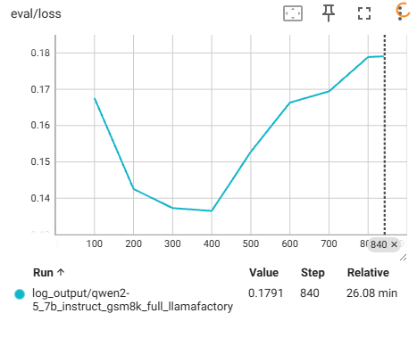

# LLM微调代码Pipeline快速上手教程
- 作者：[@Sunnyhaze](https://github.com/SunnyHaze)
- 旨在快速让新手在初步了解LLM背后，希望能上手代码快速微调模型，获得一些正反馈来激励自己继续精进LLM的学习。
- 本仓库欢迎后来者实践的过程中提出PR，也可以积极联系前辈修改完善！
## 前言
- 目前对于LLM的Supervised Finetune（SFT），非常常用且封装的很好的工具就是LLAMA-Factory。几乎只需要下载好数据集和模型，修改配置文件（比如JSON和YAML）即可实现LLM的训练和微调，目前LLAMA-FACTORY支持了llama，qwen等等性能很好的主流常见基座模型，可以极其方便的开展下游SFT训练实验。此外，一些PPO和DPO这样的强化学习微调算法，也可以被LLAMA-factory支持。
- LLM在完成训练后，如何量化评估模型的性能也是个麻烦事儿。一般来说对于数学任务，采用正则匹配答案的位置，并计算准确率是比较常见的方案。这里选择了一个也比较广泛使用的框架[lm-evaluation-harness](https://github.com/EleutherAI/lm-evaluation-harness)，这样可以比较高效的完成模型inference并自动按照规则正则匹配是否有正确答案，并计算准确率。
## 安装Llama-Factory

1. 官方仓库：https://github.com/hiyouga/LLaMA-Factory
2. 安装命令，一般找一个工作路径clone下来安装即可：
```shell
git clone --depth 1 https://github.com/hiyouga/LLaMA-Factory.git
cd LLaMA-Factory
pip install -e ".[torch,metrics]"
```
1. 测试是否安装正确：
```
llamafactory-cli version
```
如果安装正确的话，会报告版本信息以及官方github仓库链接。

## 准备数据集
GSM8k数据集是一个包含8.5k条小学数学题的数据集，包含自然语言推理和最终答案。
- Github：https://github.com/openai/grade-school-math
- 论文链接： https://arxiv.org/abs/2110.14168


这里给出一条其中的样例数据以供参考（这条数据并不是原始的格式，而是经过修改对齐了llama-factory的API的json版本，但内容和形式是一致的）：
```json
    {
        "input": "Alexis is applying for a new job and bought a new set of business clothes to wear to the interview. She went to a department store with a budget of $200 and spent $30 on a button-up shirt, $46 on suit pants, $38 on a suit coat, $11 on socks, and $18 on a belt. She also purchased a pair of shoes, but lost the receipt for them. She has $16 left from her budget. How much did Alexis pay for the shoes?",
        "output": "Let S be the amount Alexis paid for the shoes.\nShe spent S + 30 + 46 + 38 + 11 + 18 = S + <<+30+46+38+11+18=143>>143.\nShe used all but $16 of her budget, so S + 143 = 200 - 16 = 184.\nThus, Alexis paid S = 184 - 143 = $<<184-143=41>>41 for the shoes.\n#### 41"
    },
```
特别注意，这个问答在输出时，末尾会以`#### xxx`这个格式输出最终的答案。这个也是观察我们SFT是否有效的一个参考。，


`datasets`是由huggingface管理的一个python库，可以直接通过pip下载。上面管理了许多NLP、CV和多模态的经典任务，可以非常方便的下载各种数据集。`datasets`库的官方文档请参考[这里](https://arxiv.org/abs/2110.14168)。我们这里使用该库下载GSM8k数据集。在任意路径下，创建并copy如下python代码即可下载数据集，注意，需要修改缓存目录为你的工作路径。（此文件在本仓库的[./dataset_scripts/download_gsm8k.py](./dataset_scripts/download_gsm8k.py)下也有一份）
```python
import os
import datasets
from datasets import load_dataset
os.environ['HF_ENDPOINT'] = 'https://hf-mirror.com'
cache_dir = "/mnt/data1/xiaochen/llm/datasets"  # 修改为你的缓存目录

dataset = load_dataset("openai/gsm8k", "main", cache_dir=cache_dir)
print(dataset['train'][0])
```
下载后，会看到在`cache_dir`下多了这个数据集的文件夹。但目前的格式并没有对齐LLAMA-FACTORY所需要的格式，所以为了正常索引，需要组织一个`dataset_info.json`来让LLAMA_FACTORY可以正常读取数据集信息。因为下文的json使用了相对路径，所以需要放置在`gsm8k-train.arrow`的同一个文件夹下。它原来也有一个`dataset_info.json`这个文件夹可以重命名为`dataset_info_backup.json`以作留档。

```json
{
    "gsm8k_math_train": {
      "file_name": "gsm8k-train.arrow",
      "formatting": "alpaca",
      "columns": {
        "query": "question",
        "response": "answer"
      }
    },
  
    "gsm8k_math_test": {
      "file_name": "gsm8k-test.arrow",
      "formatting": "alpaca",
      "columns": {
        "query": "question",
        "response": "answer"
      }
    }
  }
```

这个json可以帮助llama-factory读取.arrow文件，并且按照`columns`的的key来对于数据集的key进行映射，以满足llamafactory本身的API接口要求。

这样我们就完成了数据集的下载，以及对于LLAMA-Factory接口的对齐。

## 模型下载
- huggingface被墙的厉害，qwen可以使用[ModelScope](https://www.modelscope.cn/docs/intro)进行下载。文档和参考也在上面的链接中。本文主要使用`Qwen2.5-7B-Instruct`和`Qwen2.5-1.5B-Instruct`进行微调。

- 
为方便管理路径，指定到具体文件夹下下载[Qwen2.5-7B-Instruct](https://www.modelscope.cn/models/Qwen/Qwen2.5-7B-Instruct/)（需要修改为你的工作路径）：
```
modelscope download --model Qwen/Qwen2.5-7B-Instruct --local_dir /mnt/data1/xiaochen/llm/models/Qwen2.5-7B-Instruct
```

同理[Qwen2.5-1.5B-Instruct](https://www.modelscope.cn/models/Qwen/Qwen2.5-7B-Instruct/)的下载：
modelscope download --model Qwen/Qwen2.5-1.5B-Instruct --local_dir /mnt/data1/xiaochen/llm/models/Qwen2.5-1.5B-Instruct
## 模型训练
LLAMA-FACTORY目前的训练通过一个`yaml`文件管理所有的训练参数。官方提供了大量的样例以供参考：[Github的examples](https://github.com/hiyouga/LLaMA-Factory/tree/main/examples/train_lora)。

这里提供本仓库所使用的yaml文件以供参考，所有的`yaml`都在[./train_yaml](./train_yaml)下。
```yaml
### qwen2.5-1.5B-Instruct-gsm8k.yaml
### model
model_name_or_path: /mnt/data1/xiaochen/llm/models/Qwen2.5-1.5B-Instruct # 使用下载好的Qwen2.5-7b
trust_remote_code: true

### method
stage: sft
do_train: true
report_to: tensorboard    # Tensorboard设置
logging_dir: ./log_output/qwen2-5_1-5b_instruct_gsm8k_full_llamafactory 
finetuning_type: lora
lora_rank: 16
lora_target: all
flash_attn: fa2

### dataset
dataset_dir: /mnt/data1/xiaochen/llm/datasets/openai___gsm8k/main/0.0.0/e53f048856ff4f594e959d75785d2c2d37b678ee
dataset: gsm8k_math_train
template: qwen
cutoff_len: 1024      # 上下文最大长度（GSM8k一般不超过此长度）
max_samples: null     # Null 代表使用全部数据
overwrite_cache: true # 重新处理数据时强制刷新缓存
preprocessing_num_workers: 16 # 数据预处理并行进程数
dataloader_num_workers: 4

### output
output_dir: ./output/qwen2-5_1-5b_instruct_gsm8k_lora_llamafactory
logging_steps: 10
save_steps: 100
plot_loss: true
overwrite_output_dir: true
save_only_model: false

### train
per_device_train_batch_size: 2
gradient_accumulation_steps: 4
learning_rate: 3.0e-5     # 
num_train_epochs: 6       # GSM8k需要更多Epoch学习推理逻辑
max_grad_norm: 0.5        # 梯度裁剪阈值
lr_scheduler_type: cosine
warmup_ratio: 0.15
bf16: true
ddp_timeout: 180000000
resume_from_checkpoint: null

### eval
# eval_dataset: alpaca_en_demo 
val_size: 0.1
per_device_eval_batch_size: 4
eval_strategy: steps
eval_steps: 100   # 每100步验证一次
```


> [!IMPORTANT]
>注意，本实验中通过以`0.1`为比例，从原始训练集划分出`训练集`和`验证集`用于观测训练状态，且因为GSM8k数据集较小，所以用了多个epoch来进行训练。在实际情况下，一般会将多个数据集合在一起，构建较大的数据集然后只训练一个epoch观测结果。

在路径下构建好所需的YAML和参数后，使用llamafactory-cli即可方便的调用训练，该库自动调用accelerate或者deepspeed实现多卡加速。
```shell
llamafactory-cli train ./train_yaml/llama_train_qwen1-5binstruct_gsm8k.yaml
```

训练过程中，可以使用如下命令，通过`tensorboad`来观测训练过程。
```
tensorboard --logdir ./ 
```

这里我们观察训练过程中在`eval`（实际是验证集）的loss，观测到如下现象：



这里发现loss最低处在400 step时，则保留这个checkpoint作为我们训练好的模型。因为后续验证集的loss又呈现上升趋势，所以400step以后的训练可能是过拟合的。（因为显卡数量和batchsize不同，所以复现时的step数可能不一样）

## 合并SFT后做好的模型参数和原始参数
如果你了解Lora的训练技术，你会知道LORA本身只训练了一组低秩矩阵的参数并保存，如果想在下游任务做评估，则需要先将lora参数和模型原始参数合并生成出新的checkpoint参数以供其他框架调用。

这个过程也需要通过yaml配合命令行的方式实现，一个样例yaml如下，其他的所有yaml都在`./merge_yaml`路径下：
```yaml
### Note: DO NOT use quantized model or quantization_bit when merging lora adapters

### model
model_name_or_path: /mnt/data1/xiaochen/llm/models/Qwen2.5-1.5B-Instruct
adapter_name_or_path: /mnt/data1/xiaochen/workspace/LLM-math-guide/output/qwen2-5_1-5b_instruct_gsm8k_lora_llamafactory/checkpoint-400
template: qwen
trust_remote_code: true

### export
export_dir: /mnt/data1/xiaochen/llm/models/qwen-gsm8k-sft/Qwen2.5-1.5B-Instruct
export_size: 5  # export_size: 5 表示每个导出文件的大小上限为 5 GB。
export_device: cpu
export_legacy_format: false

```
创建好相应的yaml后，通过如下命令即可合并相应的微调权重和原始模型权重为新的权重。
```shell
llamafactory-cli export ./merge_yaml/merge_config_qwen2-5_1-5b_instruct_gsm8k_lora.yaml 
```

## 评估模型性能
这里作者选择了`lm-eval-harness`这个框架作为评估的框架。
- 官方github：[https://github.com/EleutherAI/lm-evaluation-harness](https://github.com/EleutherAI/lm-evaluation-harness)
- 有个比较长和全面的安装使用教程，但是很多功能走马观花看一下即可，很多暂时用不到：[教程链接](https://medium.com/@cch.chichieh/llm-%E8%A9%95%E4%BC%B0%E6%95%99%E5%AD%B8-eleutherai-lm-evaluation-harness-42628a4362f7#id_token=eyJhbGciOiJSUzI1NiIsImtpZCI6ImVlYzUzNGZhNWI4Y2FjYTIwMWNhOGQwZmY5NmI1NGM1NjIyMTBkMWUiLCJ0eXAiOiJKV1QifQ.eyJpc3MiOiJodHRwczovL2FjY291bnRzLmdvb2dsZS5jb20iLCJhenAiOiIyMTYyOTYwMzU4MzQtazFrNnFlMDYwczJ0cDJhMmphbTRsamRjbXMwMHN0dGcuYXBwcy5nb29nbGV1c2VyY29udGVudC5jb20iLCJhdWQiOiIyMTYyOTYwMzU4MzQtazFrNnFlMDYwczJ0cDJhMmphbTRsamRjbXMwMHN0dGcuYXBwcy5nb29nbGV1c2VyY29udGVudC5jb20iLCJzdWIiOiIxMDkwMDM0Mzg1OTIzNTMyMDQwOTUiLCJlbWFpbCI6ImZiYW5odWExMTIzQGdtYWlsLmNvbSIsImVtYWlsX3ZlcmlmaWVkIjp0cnVlLCJuYmYiOjE3MzkwMDkxNjIsIm5hbWUiOiJubiBubiIsInBpY3R1cmUiOiJodHRwczovL2xoMy5nb29nbGV1c2VyY29udGVudC5jb20vYS9BQ2c4b2NMSUxuYXgwUS1Kd2NLVUstNlJNZnBwZ29yU1A0U19jdHFub08yWXRSRmtxV2ZVc0ZJPXM5Ni1jIiwiZ2l2ZW5fbmFtZSI6Im5uIiwiZmFtaWx5X25hbWUiOiJubiIsImlhdCI6MTczOTAwOTQ2MiwiZXhwIjoxNzM5MDEzMDYyLCJqdGkiOiJhMWIwNzY3N2EwMWU2OTU3ZTE2MWVhMWE1NGUwOGE3ZjE3NmU0ZGYwIn0.oC9JTA1bLjqtrN9YV16Qt9w86OCCkAsWF84nW7O0cfTQ-lbv4OGj1SfXfsPRzHvaS5V4eNPL2_ZhL9VM6wPiXDwUpqcPXe7YAnSfugeJdaRDOlI8a6TbAhFsle2Qn3Dq9BdnD2aJERIe3rgbZ04Vb_uChI5AvRvsieKLOwpy_sHVxDbuViSkcOw-eM-aCDbM3CRHKwYqWA6WkF2GJG3-CCbzuKNadDJhfO0BPThZA7cqce7lXDq8olJADXVVL8Wv8T95FqEQZVBxcONhtSnMGzbPyFb-ksBudkS6LGREzhR1MGgHy8qDeKM8m-D1ZCkij7VJoq1XB4h8Vq5VzLn9MA)


如果只是精简地想要完成使用，那参考官方github的命令，在某个工作路径下执行如下命令完成安装即可：
```shell
git clone --depth 1 https://github.com/EleutherAI/lm-evaluation-harness
cd lm-evaluation-harness
pip install -e .
```
因为gsm8k这个任务已经被内置在这个框架下了，所以直接通过命令行即可完成验证试验：
```shell
lm_eval --model hf --model_args pretrained="/mnt/data1/xiaochen/llm/models/qwen-gsm8k-sft/Qwen2.5-1.5B-Instruct" --tasks gsm8k --device cuda:0 --batch_size 8 --output_path ./eval_results --num_fewshot 0
```
如果使用多卡评估，则采用如下方式即可：
```shell
accelerate launch -m lm_eval --model hf --model_args pretrained="/mnt/data1/xiaochen/llm/models/qwen-gsm8k-sft/Qwen2.5-1.5B-Instruct" --tasks gsm8k --batch_size 8 --output_path ./eval_results --num_fewshot 0
```
注意，这种方式会额外下载一份gsm8k数据集，如果想要直接使用刚才下载到本地的gsm8k数据集，可以通过复制`\lm-evaluation-harness\lm_eval\tasks\gsm8k\gsm8k.yaml`这个文件，按照官方教程重命名一份为`gsm8k_local.yaml`，然后按照[官方教程](\lm-evaluation-harness\lm_eval\tasks\gsm8k)修改路径即可。

所有的指令在`lm_eval_scripts`下有本实验使用到的一些对应的`shell`脚本可以方便的重复试验。


而后这里是在不同模型，经过SFT后的评估结果，通过`lm-evaluation-harness`输出的日志得到：

hf (pretrained=/mnt/data1/xiaochen/llm/models/qwen-gsm8k-sft/Qwen2.5-1.5B-Instruct), gen_kwargs: (None), limit: None, num_fewshot: 0, batch_size: 8
|Tasks|Version|     Filter     |n-shot|  Metric   |   |Value |   |Stderr|
|-----|------:|----------------|-----:|-----------|---|-----:|---|-----:|
|gsm8k|      3|flexible-extract|     0|exact_match|↑  |0.3791|±  |0.0134|
|     |       |strict-match    |     0|exact_match|↑  |0.4670|±  |0.0137|

hf (pretrained=/mnt/data1/xiaochen/llm/models/qwen-gsm8k-sft/Qwen2.5-7B-Instruct), gen_kwargs: (None), limit: None, num_fewshot: 0, batch_size: 8
|Tasks|Version|     Filter     |n-shot|  Metric   |   |Value |   |Stderr|
|-----|------:|----------------|-----:|-----------|---|-----:|---|-----:|
|gsm8k|      3|flexible-extract|     0|exact_match|↑  |0.6050|±  |0.0135|
|     |       |strict-match    |     0|exact_match|↑  |0.7172|±  |0.0124|

作为参考，这里还放了一个
hf (pretrained=/mnt/data1/xiaochen/llm/models/qwen-gsm8k-sft/Qwen2.5-7B-Instruct-epoch800), gen_kwargs: (None), limit: None, num_fewshot: 0, batch_size: 8
|Tasks|Version|     Filter     |n-shot|  Metric   |   |Value |   |Stderr|
|-----|------:|----------------|-----:|-----------|---|-----:|---|-----:|
|gsm8k|      3|flexible-extract|     0|exact_match|↑  |0.6065|±  |0.0135|
|     |       |strict-match    |     0|exact_match|↑  |0.7142|±  |0.0124|

以下是两个原始模型的性能参考：

hf (pretrained=/mnt/data1/xiaochen/llm/models/Qwen2.5-1.5B-Instruct), gen_kwargs: (None), limit: None, num_fewshot: 0, batch_size: 8
|Tasks|Version|     Filter     |n-shot|  Metric   |   |Value |   |Stderr|
|-----|------:|----------------|-----:|-----------|---|-----:|---|-----:|
|gsm8k|      3|flexible-extract|     0|exact_match|↑  |0.1463|±  |0.0097|
|     |       |strict-match    |     0|exact_match|↑  |0.0000|±  |0.0000|

hf (pretrained=/mnt/data1/xiaochen/llm/models/Qwen2.5-7B-Instruct), gen_kwargs: (None), limit: None, num_fewshot: 0, batch_size: 8
|Tasks|Version|     Filter     |n-shot|  Metric   |   |Value |   |Stderr|
|-----|------:|----------------|-----:|-----------|---|-----:|---|-----:|
|gsm8k|      3|flexible-extract|     0|exact_match|↑  |0.7127|±  |0.0125|
|     |       |strict-match    |     0|exact_match|↑  |0.0000|±  |0.0000|

## 分析评估结果
首先，必须要明确的是`flexible-extract`和`strict-match`这两个模式有什么区别。前者是通过正则匹配所有的`数字字符串`，然后只取正则匹配结果的`最后一个`。作为相应的答案进行对比，如果一致则为正确。而`strict-match`则是按照gsm8k的末尾输出的格式来匹配，即严格匹配一个`#### xx`的字符串作为最后答案进行对比。

相信各位对于`lm-eval-harness`中`flexible-extract`和`strict-match`行为仍然很困惑，这里笔者进一步探索了一下它具体的实现。这里可以参考它在`gsm8k.yaml`这个任务的配置文件中的设置：[官方链接](https://github.com/EleutherAI/lm-evaluation-harness/blob/908ac2b241ecba364e3dc1b500971f5a4fb36bb2/lm_eval/tasks/gsm8k/gsm8k.yaml#L33-L43)。可以看到两者都是通过两个正则表达式实现匹配，而后者区别在于`group_select`设置为了-1，即选取最后一个正则匹配项；`group_select`默认为0,即选取第一个匹配项。此后，两个模式都配合了一个`take_first`过滤器来完成答案过滤。关于具体这些filter的行为，本文提供了一个关于这个框架的[测试代码](./scripts/test_filter_in_lm_eval_harness.py)以供参考，有兴趣的同学可以运行一下。

回到任务本身，所以，可以看到未经SFT的原始两个qwen模型，在`strict-match`模式下的准确率都为0，因为没有学习到`####`后输出答案的范式。相比之下，微调后的模型明显学习到了相应的回答方式。

而当我们将7B和1.5B模型的性能进行横向对比时，发现SFT对于1.5B的模型提升相当明显，但是对于7B来说只是纠正了相应的回答范式。所以7B模型可能已经高效地学习过这样的任务了。


笔者这里只提供了部分结果，如果有兴趣探索可以尝试自己写自动化脚本，批量完成相应的训练和测试。这些工作也可以让gpt或者Deepseek帮你高效完成。

## 结语
笔者认为，按照本仓库的子文件夹方式组织各种脚本，也算是一个比较好的开展LLM相关实验的范式，可以作为参考，如果有更好的意见和建议，也欢迎讨论。